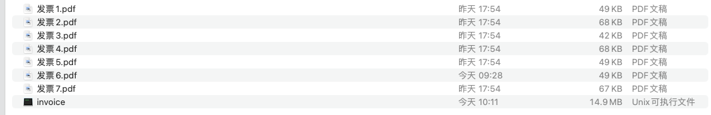
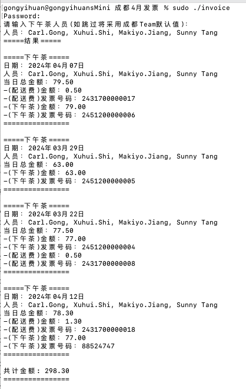
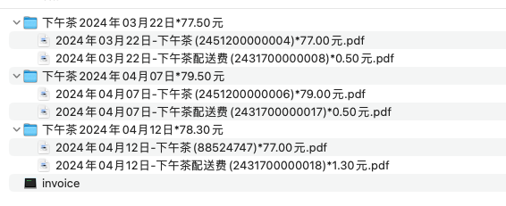

# invoice
gen-invoice

**1. 将发票与invoice 程序放置在相同目录**

   
2. 命令窗进入发票的目录，**执行`sudo ./invoice`**
3. 
    
3. 可以复制结果内容，提交app

### --after--# invoice
gen-invoice

**1. 将发票与invoice 程序放置在相同目录**

    
2. 命令窗进入发票的目录，**执行`sudo ./invoice`**

    
3. **可以复制结果下的内容，提交Approval**
4. **查看发票目录，已经根据发票内容进行整合，可以压缩打包发送**
    

